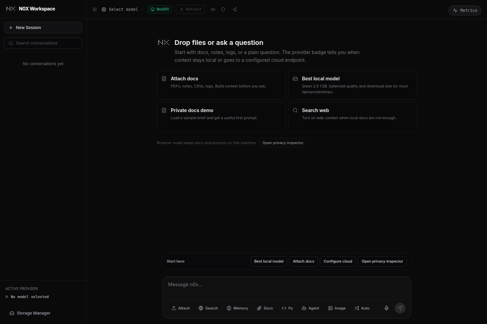

<div align="center">
  
  <h1>n0x</h1>
  <p><strong>Run local LLMs, agents, document retrieval, and Python in your browser.</strong></p>
  <p>Local by default. Search, image and cloud paths are explicit.</p>

  <p>
    <a href="https://n0xth.vercel.app"></a>
    &nbsp;
    <a href="https://github.com/ixchio/n0x/stargazers"></a>
    &nbsp;
    <a href="https://github.com/ixchio/n0x/blob/main/LICENSE"></a>
    &nbsp;
    <a href="https://github.com/ixchio/n0x/actions"></a>
  </p>

  <a href="https://www.producthunt.com/products/n0x?utm_source=badge-featured&utm_medium=badge&utm_campaign=badge-n0x" target="_blank">
    
  </a>
</div>

<br />



<br />

---

## What is n0x?

n0x is a local-first AI workstation. Its Browser provider uses **WebGPU** and **WebAssembly** for inference, document retrieval, and Python execution without a hosted inference account.

You get:

- **Local LLM inference** with 21 verified WebLLM models
- **Autonomous agent** with a real ReAct loop and live tool use
- **Document Q&A** with hybrid RAG (vector + BM25 + MMR reranking)
- **Python runtime** via Pyodide WASM — runs `import numpy` in the browser
- **Multi-engine web search** (SearXNG · DDG · Wikipedia · Brave · Tavily)
- **Image generation** through an explicit Pollinations/AI Horde network route
- **Optional persistent memory** saved and recalled only when Memory is enabled

Local chat, RAG, conversation history, enabled memory, and Python execution run client-side. First-time model, embedding, and Pyodide downloads use the network. Deep Search, image generation, browser speech services, remote Ollama hosts, and Cloud API providers can also send relevant input off-device when you choose them.

---

## Demo

| Feature                          | Preview                                                                                      |
| -------------------------------- | -------------------------------------------------------------------------------------------- |
| Private docs first run           |  |
| Landing page product positioning |                 |

---

## Quickstart

**Requirements:** Chrome or Edge 113+ (WebGPU). Node 20 is recommended and used by CI.

```bash
git clone https://github.com/ixchio/n0x.git
cd n0x
npm install
npm run dev
```

Open `http://localhost:3000` and pick a model. The first load downloads the size shown in the selector (roughly 360MB–5.5GB); later loads reuse the browser cache unless the browser evicts it or you clear Model Weights. App shell updates preserve separately cached WebLLM downloads.

> **Just want to try it?** → [n0xth.vercel.app](https://n0xth.vercel.app) — no install needed.

### Optional env vars

```env
# All optional; local chat does not need them.
TAVILY_API_KEY=tvly-xxxxx       # Research-grade search
BRAVE_API_KEY=BSA-xxxxx         # Additional search provider
POLLINATIONS_API_KEY=your-key   # Authenticated image route; kept server-side
```

---

## Project structure

```text
app/                  Next.js routes, metadata, and API routes
components/brand/     N0X identity marks and brand primitives
components/chat/      Chat workbench UI, messages, panels, and sharing
components/layout/    Shell and navigation components
components/system/    PWA, onboarding, storage, skeletons, and boundaries
components/ui/        Reusable low-level UI primitives
lib/chat/             Chat orchestration, routing, and conversation state
lib/core/             Analytics and logging utilities
lib/media/            Speech, TTS, and interaction sound hooks
lib/memory/           Persistent semantic memory
lib/providers/        WebGPU, Chrome AI, Ollama, and cloud providers
lib/retrieval/        RAG, deep search, and document workers
lib/runtime/          Agent loop, Pyodide, and WebContainer runtime hooks
public/brand/         Launch and marketplace brand assets
public/screenshots/   Current product screenshots
```

---

## Provider support

Four backends. You can switch mid-conversation without replacing chat history.

| Provider             | What runs                                             | Setup                                       |
| -------------------- | ----------------------------------------------------- | ------------------------------------------- |
| **Browser (WebGPU)** | 21 curated, verified open-source models via WebLLM    | Pick a model; weights download on first use |
| **Ollama**           | Models exposed by your configured Ollama server       | Start Ollama and allow browser CORS         |
| **Cloud API**        | OpenAI-compatible streaming chat-completion endpoints | Paste a trusted endpoint, key, and model    |
| **Chrome AI**        | Gemini Nano through Chrome's built-in Prompt API      | Requires Prompt API availability in Chrome  |

When enabled and both paths are available, **auto-routing** classifies each message and can send more complex queries to the configured cloud provider.

---

## Models

The selector exposes 21 MLC-compiled models verified against the installed WebLLM app config. They are quantized and cached after the first download.

| Tier                   | Verified models                                                           | Approx. download |
| ---------------------- | ------------------------------------------------------------------------- | ---------------- |
| ⚡ **Tiny (4)**        | SmolLM2 360M/1.7B · Qwen 2.5 0.5B · TinyLlama 1.1B                        | 360MB–900MB      |
| ⚖️ **Balanced (6)**    | Llama 3.2 1B/3B · Qwen 2.5 1.5B · Gemma 2 2B · Phi-3 Mini · Phi-3.5 Mini  | 700MB–2.2GB      |
| 🚀 **Powerful (6)**    | Qwen 2.5 3B/7B · Mistral 7B · Llama 3.1 8B · Gemma 2 9B · Hermes 2 Pro 8B | 2GB–5.5GB        |
| 🧠 **Reasoning (2)**   | DeepSeek R1 Distill Qwen 7B · DeepSeek R1 Distill Llama 8B                | 4.5GB–4.8GB      |
| 💻 **Code & math (3)** | Qwen 2.5 Coder 1.5B/7B · Qwen 2.5 Math 1.5B                               | 1GB–4GB          |

**Recommended start:** Qwen 2.5 1.5B (~1GB). Loads fast, handles most tasks well.

---

## Features in depth

<details>
<summary><strong>🤖 Agent mode — ReAct loop with live tool use</strong></summary>

The LLM plans, calls tools, observes results, and repeats — you watch every step in real time.

**Tools available:**

- Multi-engine web search when Deep Search is enabled for the request
- Hybrid document RAG (Vector + BM25 + MMR)
- Python execution (Pyodide WASM runtime)
- Persistent memory read/write when Memory is enabled (IndexedDB)

Image generation uses its own explicit network request path rather than being invoked implicitly by the agent loop.

**Reliability features:**

- Multi-strategy JSON parser — handles malformed tool calls
- Loop detection — stops if the same tool is called 3× with the same args
- Per-tool timeout (45s)
- Provider-aware context budget management
- Max 12 iterations per run

</details>

<details>
<summary><strong>📄 Document Q&A — hybrid local RAG</strong></summary>

Drop a supported text document into chat.

**Pipeline:**

1. Local text extraction for PDF, DOCX, and text-based formats
2. Sentence-boundary-aware chunking (50% overlap)
3. MiniLM-L6 embeddings in a Web Worker
4. Dual index: **Voy** (vector) + **BM25** (keyword)
5. RRF fusion (Reciprocal Rank Fusion) + MMR reranking for diversity
6. Versioned vector cache in IndexedDB for faster re-upload

**Formats:** PDF · DOCX · TXT · MD · CSV · HTML · JSON · XML · YAML · TOML · INI · CFG · CONF · LOG · RST · TEX

**Limits:** 25MB per file, 32MB expanded DOCX content, 750,000 extracted characters, and the first 100 pages of a PDF. Corrupt or unsupported binary files are rejected rather than attached as text placeholders.

</details>

<details>
<summary><strong>🔍 Deep Search — multi-engine, parallel, cited</strong></summary>

Toggle "Deep Search" and get synthesized answers with source cards, not a wall of text.

**Sources (used according to availability and query type):**

- 🔍 SearXNG — privacy-respecting, self-hosted pool
- 🦆 DuckDuckGo — instant answers
- 📖 Wikipedia — authoritative
- 🦁 Brave Search — optional API key
- 🔬 Tavily — optional API key, research-grade
- 📄 Jina Reader — conditional page extraction when snippets are thin

**Output:** Perplexity-style source cards with favicons, progress bar, expandable full content. No raw dumps.

</details>

<details>
<summary><strong>🐍 Python runtime — Pyodide WASM</strong></summary>

Full CPython runs in the browser. The Pyodide runtime and requested packages download from jsDelivr on first use.

- Output feeds back into the conversation automatically
- Execution errors go to the LLM for a self-healing retry
- `micropip` available for packages not in the default bundle

</details>

<details>
<summary><strong>🧠 Persistent memory</strong></summary>

When Memory is enabled, successful exchanges can be summarized into IndexedDB and relevant saved memories can be added to later prompts. When it is disabled, N0X neither automatically saves nor retrieves semantic memories; existing entries remain stored until you delete them.

- Hybrid retrieval: TF-IDF weighted n-grams + vector similarity
- Tags: `chat` · `search` · `rag` · `cloud` · `local`
- Toggle memory saving and retrieval together per session
- Storage managed via built-in Storage Manager

</details>

<details>
<summary><strong>🎨 Image generation</strong></summary>

Say "generate an image of..." to use the explicit image network route.

- With no server key, the route returns a client-loadable free Pollinations URL.
- With `POLLINATIONS_API_KEY`, the server tries authenticated Pollinations models, then AI Horde if those attempts fail.
- If configured providers fail, the final fallback is the free Pollinations URL; generation can still fail or be rate-limited.

Image prompts leave the device and are subject to third-party terms and availability.

</details>

<details>
<summary><strong>🎤 Voice — STT + TTS</strong></summary>

N0X uses the browser Web Speech APIs. Speech recognition and some voices may use an online browser or operating-system service; offline operation is not guaranteed.

- Mic button → speak → auto-submit
- TTS toggle → responses read aloud
- Interrupt mid-speech

</details>

<details>
<summary><strong>🌳 Conversation branching</strong></summary>

Click any message → Branch → create an alternate timeline from that point. Both branches persist in the sidebar independently.

</details>

---

## Architecture

```
                          ┌──────────────────────┐
                          │    Provider Layer     │
                          │ WebGPU · Ollama ·     │
                          │ Cloud · Chrome AI     │
                          └─────────┬────────────┘
                                    │
┌──────────┐   ┌────────────┐  ┌───▼─────┐
│  Input   │──▶│ Auto-Router│─▶│  LLM    │
│  + Files │   │ complexity │  │ Stream  │
└──────────┘   │ classifier │  └───┬─────┘
               └────────────┘      │
                               ┌───▼──────────────────────┐
                               │  Agent (ReAct Loop)       │
                               │  think → act → observe    │
                               │                           │
                               │  Tools:                   │
                               │  ├─ Web Search (5 engines)│
                               │  ├─ Hybrid RAG (Vec+BM25) │
                               │  ├─ Python (Pyodide WASM) │
                               │  ├─ Memory (IndexedDB)    │
                               │  └─ Image Gen             │
                               └───────────────────────────┘

  RAG pipeline (Web Worker):
  PDF/DOCX → chunks → MiniLM embeds → Voy + BM25 → RRF → MMR → context
```

Local by default. Search, image and cloud paths are explicit. Other network-dependent paths are first-time model/embedding downloads, Pyodide and package downloads, remote Ollama servers, optional page-view/funnel telemetry, and browser speech implementations that use an online service.

---

## Performance and storage

Inference speed and usable model size depend on the model, GPU, drivers, browser, available memory, thermals, and prompt length. Mobile devices are treated as low-memory and should start with the smallest model.

Model weights and RAG vectors are cached for reuse. Browsers can evict either cache under storage pressure, and clearing site data or the corresponding Storage Manager entry removes it. N0X service-worker upgrades remove only old app-shell caches and preserve separately named WebLLM model caches.

---

## Privacy

**Local by default. Search, image and cloud paths are explicit.**

| What                       | Where it goes                                                              |
| -------------------------- | -------------------------------------------------------------------------- |
| Local prompts & responses  | Conversation history in origin-scoped IndexedDB                            |
| Uploaded documents         | Extracted/indexed locally; relevant excerpts can enter a prompt you send   |
| Enabled semantic memory    | Origin-scoped IndexedDB; automatic saving and retrieval stop when disabled |
| Model and embedding assets | Downloaded from their hosts, then reused from browser-managed caches       |
| Search queries             | N0X API route, then enabled search/extraction providers                    |
| Image prompts              | N0X API route, then Pollinations and, on the configured path, AI Horde     |
| Cloud API prompts          | The OpenAI-compatible endpoint you configure                               |
| Voice input/output         | Browser Web Speech implementation; it may use an online vendor service     |
| Opt-in telemetry           | Sanitized page views to Vercel; funnel events to the N0X analytics route   |

After dependencies are cached, local chat and document retrieval can work without enabling search, images, cloud, or telemetry. That is not an air-gap guarantee: uncached assets, Pyodide packages, remote Ollama, and some browser speech implementations still use the network.

Full details: [Privacy Policy](https://n0xth.vercel.app/privacy) · [Security](https://n0xth.vercel.app/security) · [Known Limitations](https://n0xth.vercel.app/known-limitations)

---

## Stack

| Layer          | Tech                                                             |
| -------------- | ---------------------------------------------------------------- |
| Framework      | Next.js 15 · React 18 · TypeScript                               |
| Styling        | Tailwind CSS · Framer Motion                                     |
| LLM runtime    | WebLLM (WebGPU) · Chrome Prompt API · Ollama · OpenAI-compatible |
| Embeddings     | Transformers.js · MiniLM-L6 (Web Worker)                         |
| Vector search  | Voy                                                              |
| Keyword search | BM25 (custom implementation)                                     |
| Python         | Pyodide WASM                                                     |
| Storage        | IndexedDB · Cache API · localStorage · sessionStorage            |
| Search         | SearXNG · DuckDuckGo · Wikipedia · Brave · Tavily · Jina Reader  |
| Image gen      | Pollinations · AI Horde                                          |
| CI             | GitHub Actions · ESLint · Prettier · TypeScript                  |

---

## Roadmap

Planned and in progress:

- [ ] 🎤 Whisper.cpp voice (offline, wake word)
- [ ] 🖼️ Multimodal RAG (OCR + image understanding)
- [ ] 🕸️ Knowledge graph (entity/relationship extraction)
- [ ] 🤖 Custom agents (user-defined, shareable)
- [ ] 📱 Full mobile PWA (offline, native features)
- [ ] 🔌 Plugin system (GitHub · Notion · Slack)
- [ ] 🎥 Video understanding (upload + Q&A)
- [ ] 🌐 WebRTC collaboration (shared sessions)

[Discuss and vote on features →](https://github.com/ixchio/n0x/discussions)

---

## Contributing

Issues, PRs, and ideas are all welcome. See [CONTRIBUTING.md](CONTRIBUTING.md) for the full guide.

**Quick flow:**

```bash
# 1. Fork + clone
git clone https://github.com/YOUR_USERNAME/n0x.git && cd n0x

# 2. Install
npm install

# 3. Branch
git checkout -b fix/your-thing

# 4. Dev
npm run dev

# 5. Verify
npm run lint && npm run typecheck && npm test && npm run format:check && npm run build

# 6. PR
git push origin fix/your-thing
```

**Found a bug?** [Open an issue](https://github.com/ixchio/n0x/issues) — browser console errors and OS/browser version are super helpful.

---

## Credits

Built by [ixchio](https://github.com/ixchio).

Powered by amazing open-source work:

- [MLC-LLM / WebLLM](https://github.com/mlc-ai/web-llm) — WebGPU inference engine
- [Transformers.js](https://github.com/xenova/transformers.js) — in-browser embeddings
- [Pyodide](https://github.com/pyodide/pyodide) — CPython compiled to WASM
- [Voy](https://github.com/tantaraio/voy) — WASM vector search
- [PDF.js](https://github.com/mozilla/pdf.js) — PDF parsing

---

## License

MIT © [ixchio](https://github.com/ixchio)

---

<div align="center">
  <strong>Free. Local. Private. Powerful.</strong>
  <br />
  No sign-up. Local chat needs no API key. Telemetry is opt-in.
  <br /><br />
  <a href="https://n0xth.vercel.app"><strong>Try n0x →</strong></a>
  &nbsp;·&nbsp;
  <a href="https://github.com/ixchio/n0x/issues">Report a bug</a>
  &nbsp;·&nbsp;
  <a href="https://github.com/ixchio/n0x/discussions">Request a feature</a>
</div>
