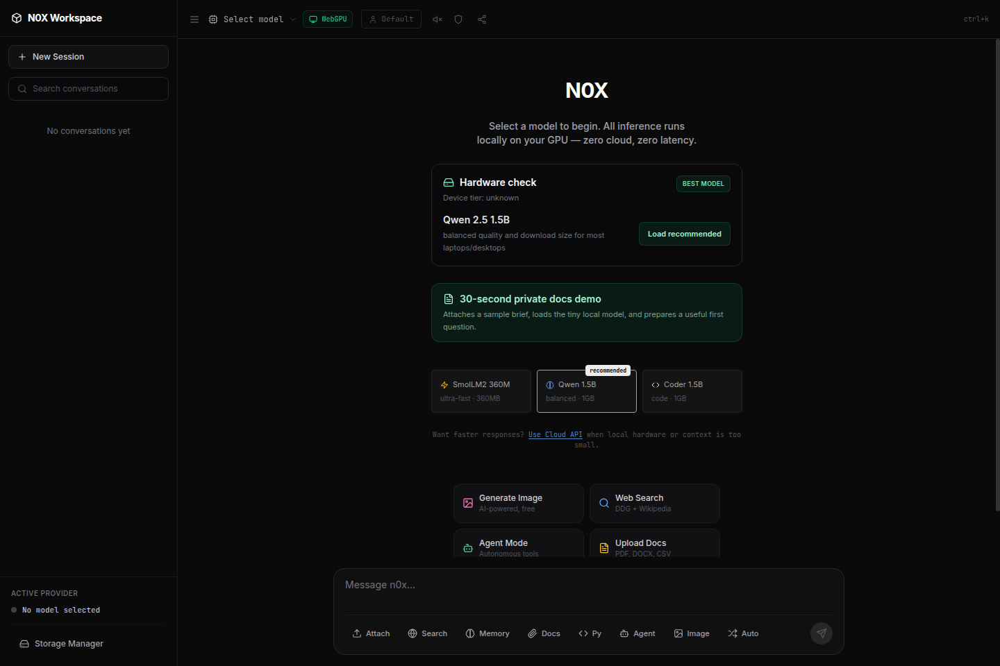
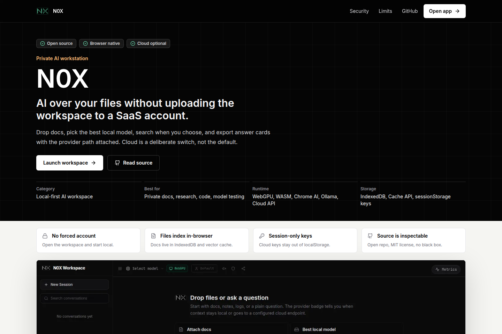

<div align="center">
  
  <h1>n0x</h1>
  <p><strong>Run LLMs, agents, RAG, Python, and image generation — entirely in your browser.</strong></p>
  <p>No server. No account. No API keys. Just open a tab.</p>

  <p>
    <a href="https://n0xth.vercel.app"></a>
    &nbsp;
    <a href="https://github.com/ixchio/n0x/stargazers"></a>
    &nbsp;
    <a href="https://github.com/ixchio/n0x/blob/main/LICENSE"></a>
    &nbsp;
    <a href="https://github.com/ixchio/n0x/actions"></a>
  </p>

  <a href="https://www.producthunt.com/products/n0x?utm_source=badge-featured&utm_medium=badge&utm_campaign=badge-n0x" target="_blank">
    
  </a>
</div>

<br />



<br />

---

## What is n0x?

n0x is a complete AI workstation that runs 100% inside your browser using **WebGPU** and **WebAssembly**. No installation, no server, no subscription.

You get:

- **Local LLM inference** at 35–80 tok/s on your GPU (via WebLLM + MLC)
- **Autonomous agent** with a real ReAct loop and live tool use
- **Document Q&A** with hybrid RAG (vector + BM25 + MMR reranking)
- **Python runtime** via Pyodide WASM — runs `import numpy` in the browser
- **Multi-engine web search** (SearXNG · DDG · Wikipedia · Brave · Tavily)
- **Image generation** via Pollinations and AI Horde — free tier, no key needed
- **Persistent memory** stored in IndexedDB, recalled across sessions

Everything runs **client-side**. Your prompts, files, and model weights never leave your machine unless you explicitly flip to cloud mode.

---

## Demo

| Feature                          | Preview                                                                                      |
| -------------------------------- | -------------------------------------------------------------------------------------------- |
| Private docs first run           |  |
| Landing page product positioning |                 |

---

## Quickstart

**Requirements:** Chrome or Edge 113+ (WebGPU). Node 18+.

```bash
git clone https://github.com/ixchio/n0x.git
cd n0x
npm install
npm run dev
```

Open `http://localhost:3000`. Pick a model. First load downloads it (~1GB). After that — instant from cache.

> **Just want to try it?** → [n0xth.vercel.app](https://n0xth.vercel.app) — no install needed.

### Optional env vars

```env
# All optional. n0x works 100% free without any of these.
TAVILY_API_KEY=tvly-xxxxx      # Research-grade search
BRAVE_API_KEY=BSA-xxxxx        # Better search quality
```

---

## Provider support

Four backends. Switch mid-conversation. Chat history stays.

| Provider             | What runs                                        | Setup                          | Speed       |
| -------------------- | ------------------------------------------------ | ------------------------------ | ----------- |
| **Browser (WebGPU)** | 50+ open-source models via WebLLM                | Zero — pick a model            | 10–80 t/s   |
| **Ollama**           | Any model from your local server                 | `ollama serve` — auto-detected | Varies      |
| **Cloud API**        | Groq, OpenRouter, any OpenAI-compatible endpoint | Paste key + base URL           | 100–500 t/s |
| **Chrome AI**        | Built-in Gemini Nano                             | Chrome 127+ with flags         | 20–40 t/s   |

**Auto-routing** classifies each message and routes simple queries local, complex ones to cloud. Configurable per-session.

---

## Models

50+ MLC-compiled models, quantized, cached in the browser after first download.

| Tier             | Models                                               | Size        | Speed     | Good for         |
| ---------------- | ---------------------------------------------------- | ----------- | --------- | ---------------- |
| ⚡ **Tiny**      | SmolLM2 360M · Qwen 0.5B · TinyLlama 1.1B            | 360MB–900MB | 60–80 t/s | Any device       |
| ⚖️ **Balanced**  | Qwen 2.5 1.5B _(default)_ · Phi-3.5 · Llama 3.2 3B   | 700MB–2.2GB | 35–50 t/s | Daily use        |
| 🚀 **Capable**   | Mistral 7B · Qwen 2.5 7B · Llama 3.1 8B · Gemma 2 9B | 4–10GB      | 15–25 t/s | High quality     |
| 🧠 **Reasoning** | DeepSeek R1 distills (1.5B → 70B)                    | 1GB–30GB    | 10–20 t/s | Chain-of-thought |
| 💻 **Code**      | Qwen Coder 1.5B/7B/32B · DeepSeek Coder              | 800MB–20GB  | Varies    | Code & math      |
| 🔥 **Flagship**  | Qwen 2.5 32B · Llama 3.3 70B · R1 Llama 70B          | 10–30GB     | 8–15 t/s  | Near GPT-4       |

**Recommended start:** Qwen 2.5 1.5B (~1GB). Loads fast, handles most tasks well.

---

## Features in depth

<details>
<summary><strong>🤖 Agent mode — ReAct loop with live tool use</strong></summary>

The LLM plans, calls tools, observes results, and repeats — you watch every step in real time.

**Tools available:**

- Multi-engine web search (5 parallel sources)
- Hybrid document RAG (Vector + BM25 + MMR)
- Python execution (Pyodide WASM sandbox)
- Persistent memory read/write (IndexedDB)
- Image generation

**Reliability features:**

- Multi-strategy JSON parser — handles malformed tool calls
- Loop detection — stops if the same tool is called 3× with the same args
- Per-tool timeout (45s)
- Context budget management — prevents OOM mid-run
- Max 12 iterations per run

</details>

<details>
<summary><strong>📄 Document Q&A — hybrid local RAG</strong></summary>

Drop a PDF, DOCX, TXT, CSV, HTML, or Markdown file into chat.

**Pipeline:**

1. Text extraction with fallback chain (PDF.js → WASM decompression → raw text)
2. Sentence-boundary-aware chunking (50% overlap)
3. MiniLM-L6 embeddings in a Web Worker (UI never blocks)
4. Dual index: **Voy** (vector) + **BM25** (keyword)
5. RRF fusion (Reciprocal Rank Fusion) + MMR reranking for diversity
6. Versioned vector cache in IndexedDB — instant re-upload

**Formats:** PDF · DOCX · TXT · MD · CSV · HTML
**Limit:** 100 pages max (OOM guard)

</details>

<details>
<summary><strong>🔍 Deep Search — multi-engine, parallel, cited</strong></summary>

Toggle "Deep Search" and get synthesized answers with source cards, not a wall of text.

**Engines (all run in parallel):**

- 🔍 SearXNG — privacy-respecting, self-hosted pool
- 🦆 DuckDuckGo — instant answers
- 📖 Wikipedia — authoritative
- 🦁 Brave Search — optional API key
- 🔬 Tavily — optional API key, research-grade

**Output:** Perplexity-style source cards with favicons, progress bar, expandable full content. No raw dumps.

</details>

<details>
<summary><strong>🐍 Python runtime — Pyodide WASM sandbox</strong></summary>

Full CPython in the browser. `import numpy`, `import pandas`, `import matplotlib` — just works.

- Output feeds back into the conversation automatically
- Execution errors go to the LLM for a self-healing retry
- `micropip` available for packages not in the default bundle

</details>

<details>
<summary><strong>🧠 Persistent memory</strong></summary>

Every conversation is summarized and stored in IndexedDB. On the next session, relevant memories are retrieved and injected into context automatically.

- Hybrid retrieval: TF-IDF weighted n-grams + vector similarity
- Tags: `chat` · `search` · `rag` · `cloud` · `local`
- Toggle memory retrieval on/off per session
- Storage managed via built-in Storage Manager

</details>

<details>
<summary><strong>🎨 Image generation</strong></summary>

Say "generate an image of..." — no API key required.

- **Pollinations** (Flux, z-image-turbo, klein, qwen-image) — free, fast
- **AI Horde** (Stable Diffusion) — community-powered

Smart fallback: Pollinations → free tier → Horde.

</details>

<details>
<summary><strong>🎤 Voice — STT + TTS</strong></summary>

Web Speech API. Works offline.

- Mic button → speak → auto-submit
- TTS toggle → responses read aloud
- Interrupt mid-speech

</details>

<details>
<summary><strong>🌳 Conversation branching</strong></summary>

Click any message → Branch → create an alternate timeline from that point. Both branches persist in the sidebar independently.

</details>

---

## Architecture

```
                          ┌──────────────────────┐
                          │    Provider Layer     │
                          │ WebGPU · Ollama ·     │
                          │ Cloud · Chrome AI     │
                          └─────────┬────────────┘
                                    │
┌──────────┐   ┌────────────┐  ┌───▼─────┐
│  Input   │──▶│ Auto-Router│─▶│  LLM    │
│  + Files │   │ complexity │  │ Stream  │
└──────────┘   │ classifier │  └───┬─────┘
               └────────────┘      │
                               ┌───▼──────────────────────┐
                               │  Agent (ReAct Loop)       │
                               │  think → act → observe    │
                               │                           │
                               │  Tools:                   │
                               │  ├─ Web Search (5 engines)│
                               │  ├─ Hybrid RAG (Vec+BM25) │
                               │  ├─ Python (Pyodide WASM) │
                               │  ├─ Memory (IndexedDB)    │
                               │  └─ Image Gen             │
                               └───────────────────────────┘

  RAG pipeline (Web Worker):
  PDF/DOCX → chunks → MiniLM embeds → Voy + BM25 → RRF → MMR → context
```

Network calls happen only when you use: search, image gen, or cloud API. Disable all three → **fully air-gapped**.

---

## Performance

### Local inference (WebGPU)

| Model         | Speed     | VRAM | Quality    |
| ------------- | --------- | ---- | ---------- |
| Qwen 2.5 1.5B | 40–50 t/s | 1GB  | Good       |
| Qwen 2.5 7B   | 15–25 t/s | 4GB  | Excellent  |
| Llama 3.3 70B | 8–12 t/s  | 30GB | GPT-4 tier |

### Cloud (Groq free tier)

| Model         | Speed       |
| ------------- | ----------- |
| Llama 3.3 70B | 200–300 t/s |
| Llama 3.1 8B  | 500+ t/s    |

### RAG

| Operation           | Time    |
| ------------------- | ------- |
| Index 100-page PDF  | ~1s     |
| Re-upload (cached)  | Instant |
| Hybrid search query | <100ms  |

---

## Privacy

**Your data stays in your browser.**

| What                | Where it goes                                 |
| ------------------- | --------------------------------------------- |
| Prompts & responses | Nowhere (local IndexedDB)                     |
| Uploaded documents  | Nowhere (local IndexedDB)                     |
| Model weights       | Nowhere (local Cache API)                     |
| Search queries      | SearXNG / DDG / Wikipedia (if search enabled) |
| Image prompts       | Pollinations API (if image gen used)          |
| Cloud API prompts   | Your chosen provider (if cloud enabled)       |

Turn off search + images + cloud = **100% air-gapped**. No telemetry, no tracking, no accounts.

Full details: [Privacy Policy](https://n0xth.vercel.app/privacy) · [Security](https://n0xth.vercel.app/security) · [Known Limitations](https://n0xth.vercel.app/known-limitations)

---

## Stack

| Layer          | Tech                                                             |
| -------------- | ---------------------------------------------------------------- |
| Framework      | Next.js 15 · React 18 · TypeScript                               |
| Styling        | Tailwind CSS · Framer Motion                                     |
| LLM runtime    | WebLLM (WebGPU) · Chrome Prompt API · Ollama · OpenAI-compatible |
| Embeddings     | Transformers.js · MiniLM-L6 (Web Worker)                         |
| Vector search  | Voy                                                              |
| Keyword search | BM25 (custom implementation)                                     |
| Python         | Pyodide WASM                                                     |
| Storage        | IndexedDB · Zustand · localStorage                               |
| Search         | SearXNG · DuckDuckGo · Wikipedia · Brave · Tavily · Jina Reader  |
| Image gen      | Pollinations · AI Horde                                          |
| CI             | GitHub Actions · ESLint · Prettier · TypeScript                  |

---

## Roadmap

Planned and in progress:

- [ ] 🎤 Whisper.cpp voice (offline, wake word)
- [ ] 🖼️ Multimodal RAG (OCR + image understanding)
- [ ] 🕸️ Knowledge graph (entity/relationship extraction)
- [ ] 🤖 Custom agents (user-defined, shareable)
- [ ] 📱 Full mobile PWA (offline, native features)
- [ ] 🔌 Plugin system (GitHub · Notion · Slack)
- [ ] 🎥 Video understanding (upload + Q&A)
- [ ] 🌐 WebRTC collaboration (shared sessions)

Full roadmap: [docs/ROADMAP.md](docs/ROADMAP.md) · [Vote on features →](https://github.com/ixchio/n0x/discussions)

---

## Contributing

Issues, PRs, and ideas are all welcome. See [CONTRIBUTING.md](CONTRIBUTING.md) for the full guide.

**Quick flow:**

```bash
# 1. Fork + clone
git clone https://github.com/YOUR_USERNAME/n0x.git && cd n0x

# 2. Install
npm install

# 3. Branch
git checkout -b fix/your-thing

# 4. Dev
npm run dev

# 5. Verify
npm run lint && npm run typecheck

# 6. PR
git push origin fix/your-thing
```

**Found a bug?** [Open an issue](https://github.com/ixchio/n0x/issues) — browser console errors and OS/browser version are super helpful.

---

## Credits

Built by [ixchio](https://github.com/ixchio).

Powered by amazing open-source work:

- [MLC-LLM / WebLLM](https://github.com/mlc-ai/web-llm) — WebGPU inference engine
- [Transformers.js](https://github.com/xenova/transformers.js) — in-browser embeddings
- [Pyodide](https://github.com/pyodide/pyodide) — CPython compiled to WASM
- [Voy](https://github.com/tantaraio/voy) — WASM vector search
- [PDF.js](https://github.com/mozilla/pdf.js) — PDF parsing

---

## License

MIT © [ixchio](https://github.com/ixchio)

---

<div align="center">
  <strong>Free. Local. Private. Powerful.</strong>
  <br />
  No sign-up. No API keys. No data collection.
  <br /><br />
  <a href="https://n0xth.vercel.app"><strong>Try n0x →</strong></a>
  &nbsp;·&nbsp;
  <a href="https://github.com/ixchio/n0x/issues">Report a bug</a>
  &nbsp;·&nbsp;
  <a href="https://github.com/ixchio/n0x/discussions">Request a feature</a>
</div>
